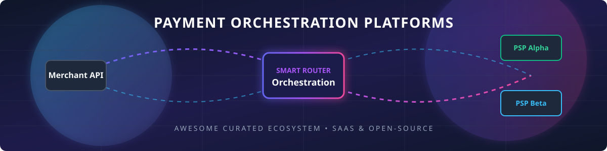

# Awesome Payment Orchestration Platform 💳⚡

  
  
  
  

## 🚀 Top Payment Orchestration Platforms Ecosystem

**Curated List of SaaS Products & Open-Source GitHub Projects**  
*Focused on Multi-PSP Routing, Tokenization/Vaulting, Intelligent Retries, Unified APIs, Smart Cascading, and Payment Infrastructure Flexibility.*

**Last updated: September 2026**

---

### 🌐 Market Size & Industry Dynamics

> 📈 **Estimated Market Size**: The global **Payment Orchestration Platform Market** is estimated at **$3.06B – $3.84B in 2026** (growing at a CAGR of **15% – 24.7%** towards **$15B+ by 2032**).  
> 🧩 **Market Fragmentation**: The payment orchestration sector is **highly fragmented** rather than a "winner-take-all" market. Driven by diverse regional payment methods (local credit cards, digital wallets, A2A, BNPL), complex global PCI DSS compliance regulations, and acquirer-level routing dynamics, merchants leverage both pure-play independent orchestrators and enterprise self-hosted platforms to maximize authorization rates and prevent vendor lock-in.

---

## 📚 Table of Contents

- [🏢 SaaS/Hosted Platforms](#-saashosted-platforms)
- [🔓 Open-Source GitHub Projects](#-open-source-github-projects)
- [🤝 How to Contribute](#-how-to-contribute)
- [⚖️ Disclaimer](#-disclaimer)
- [⭐ Star History](#-star-history)

---

## 🏢 SaaS/Hosted Platforms

| Product | Description | Pricing | Free Tier / Trial Limits | Company Size / Revenue & Valuation |
| :--- | :--- | :--- | :--- | :--- |
| **[Primer](https://primer.io/)** ⚡ | Modern workflow-driven payment orchestration platform with visual builders for routing, checkout, and payment logic. | Transaction fee model (~0.2% – 0.6% per transaction; min volume/commitment applies) | No free trial; interactive product demo available upon request | **Valuation: ~$425M** | Est. Rev: ~$31M/yr (Raised $94M+) |
| **[Finix](https://www.finix.com/)** 💳 | Payments platform with orchestration and infrastructure capabilities for platforms and marketplaces. | Direct merchant plans start at \$99/mo (Interchange + \$0.08 card-present / \$0.15 card-not-present) | Free permanent Sandbox account with API keys & dashboard access (no time limit) | **Total Funding: ~$210M** | Est. Rev: ~$36M/yr |
| **[Yuno](https://www.y.uno/)** 🌎 | Payment orchestration platform aimed at simplifying multi-provider connectivity and expansion into new markets. | Contact Sales for custom quote based on payment volume and markets | No free trial; sandbox integration environment provided upon request | **Total Funding: ~$70M** | Est. Rev: ~$150M volume index (Series B 2026) |
| **[CellPoint Digital](https://www.cellpointdigital.com/)** ✈️ | Payment orchestration and optimization platform often used in travel and complex multi-PSP environments. | Contact Sales for custom enterprise quote | No free trial; custom platform demo provided upon request | **Valuation: ~$120M** | Est. Rev: ~$25M+ (Travel/Airlines Leader) |
| **[Gr4vy](https://gr4vy.com/)** ☁️ | Cloud-native payment orchestration platform focused on centralized control, configuration, and flexible connectivity for mid-market and growing merchants. | Contact Sales for enterprise quote (based on dedicated cloud instance architecture) | No free trial; free Developer Sandbox environment available for testing | **Valuation: ~$115M** | Est. Rev: ~$5M–$10M/yr (Series A Extension) |
| **[Spreedly](https://www.spreedly.com/)** 🔒 | Established payment orchestration and vault platform enabling gateway-agnostic connectivity, tokenization, and multi-PSP routing through a single integration. | Contact Sales for custom quote (historical plans started at \$200/mo + transaction fees) | Free trial available with up to 300 free test API calls (no credit card required) | **Total Funding: ~$82.8M** | Est. Rev: ~$20M–$25M/yr |
| **[Paydock](https://paydock.com/)** ⚓ | Payment orchestration and orchestration-layer platform supporting multiple providers and unified payment experiences. | Contact Sales for enterprise volume quote | No free trial for merchant platform; sandbox environment provided upon request | **Total Funding: ~$31.1M** | Est. Rev: ~$14M–$15M/yr |
| **[Payrails](https://payrails.com/)** 🛤️ | Enterprise payment orchestration and infrastructure platform focused on modular adoption and global connectivity. | Contact Sales for custom enterprise quote | No free trial; sandbox environment accessible for enterprise evaluation | **Total Funding: ~$32M** | Est. Rev: ~$11M/yr (Series A) |
| **[IXOPAY](https://www.ixopay.com/)** 🔄 | Modular payment orchestration platform with strong tokenization, routing, cascading, and analytics capabilities. | Contact Sales for custom platform quote based on volume and connectors | No free trial; sandbox test environment available upon demo/request | **Enterprise Platform** | Est. Rev: ~$15M/yr (Merged with TokenEx) |
| **[BridgePay](https://www.bridgepaynetwork.com/)** 🌉 | Payment processing and orchestration-related solutions for connecting merchants to multiple payment rails. | Contact Sales for gateway partner pricing (merchant services start at 1.25% classic / 4.5% high-risk, \$0 setup fee) | No free trial; sandbox developer account available upon partner onboarding | **Mid-Market Provider** | Est. Rev: ~$10M–$15M/yr |
| **[ProcessOut](https://www.processout.com/)** 📊 | Payment orchestration and optimization technology supporting multi-PSP strategies. | Contact Sales for custom quote based on payment routing volume | No free trial; sandbox integration environment available upon request | **Acquired by Checkout.com** | Sub-division of Checkout.com ($11B Valuation) |

---

## 🔓 Open-Source GitHub Projects

Below is a curated list of top open-source payment orchestration, billing engine, crypto processor, and financial messaging repositories, sorted by GitHub star count:

| Repository | Description | GitHub_Stars |
| :--- | :--- | :--- |
| **[juspay/hyperswitch](https://github.com/juspay/hyperswitch)** ⚡ | Leading open-source, composable payments orchestration platform (by Juspay). Single API to multiple payment, payout, fraud, and vault providers with intelligent routing. |  |
| **[saleor/saleor](https://github.com/saleor/saleor)** 🛍️ | Modular, high-performance GraphQL-first headless e-commerce & payment gateway orchestration engine. |  |
| **[getlago/lago](https://github.com/getlago/lago)** 📊 | Open-source metering, usage-based billing, and payment orchestration API for modern SaaS & fintechs. |  |
| **[btcpayserver/btcpayserver](https://github.com/btcpayserver/btcpayserver)** ₿ | Self-hosted, open-source cryptocurrency payment processor & payment router with zero fees. |  |
| **[killbill/killbill](https://github.com/killbill/killbill)** 📑 | Open-source subscription billing and payment orchestration platform designed for complex enterprise architectures. |  |
| **[jPOS/jPOS](https://github.com/jPOS/jPOS)** 🏛️ | Mature open-source Java financial messaging & ISO-8583 transaction processing switch framework. |  |
| **[pay-rails/pay](https://github.com/pay-rails/pay)** 💎 | Multi-provider payment orchestration engine & gateway wrapper for Ruby on Rails applications. |  |

---

### 🛠️ Key Open Infrastructure Categories

- **Full Orchestration Layer**: Deploy **Hyperswitch** or **Kill Bill** for end-to-end multi-PSP routing, retries, and unified tokenization.
- **Metering & Usage Billing**: Integrate **Lago** alongside payment routers for complex SaaS charging models.
- **Financial Messaging & ISO 8583**: Leverage **jPOS** for acquirer-level switching and ISO message processing.
- **Alternative & Decentralized Rails**: Use **BTCPay Server** for non-custodial crypto payment routing and checkout flows.

---

## 🤝 How to Contribute

1. 🍴 Fork the repository.
2. 📝 Add or update entries in `README.md` following the table/badge format.
3. 🔗 Include: name, link, concise factual description, pricing/star details.
4. 🚀 Submit a Pull Request with a short summary of changes.

---

## ⚖️ Disclaimer

- This list is **community-curated** for technical evaluation and educational purposes — not financial or legal advice.
- Systems processing cardholder data must maintain strict **PCI DSS compliance**. Ensure proper tokenization, network segmentation, and security audits when self-hosting open-source components.

---

## ⭐ Star History

---

  <b>Made with ❤️ for payment engineers, fintech architects, and global merchants.</b>

